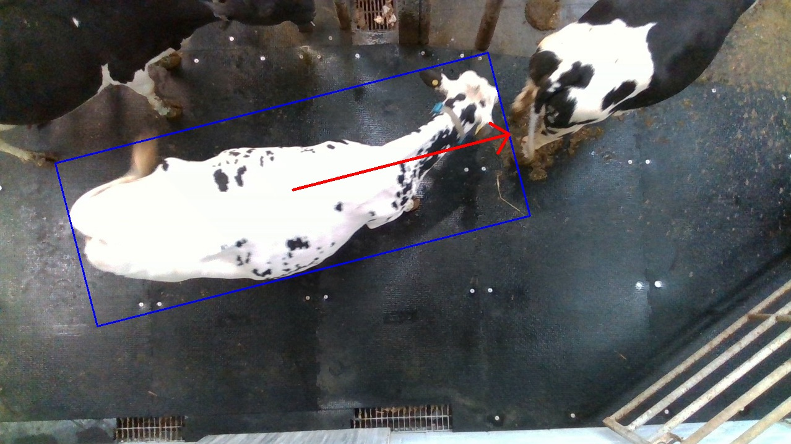
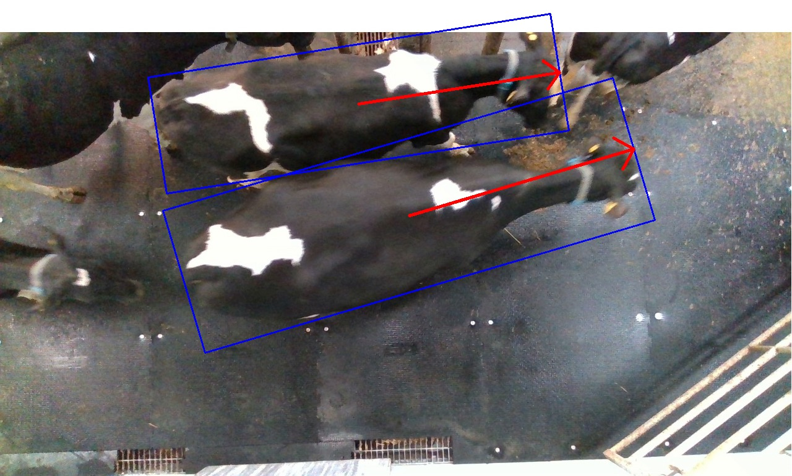
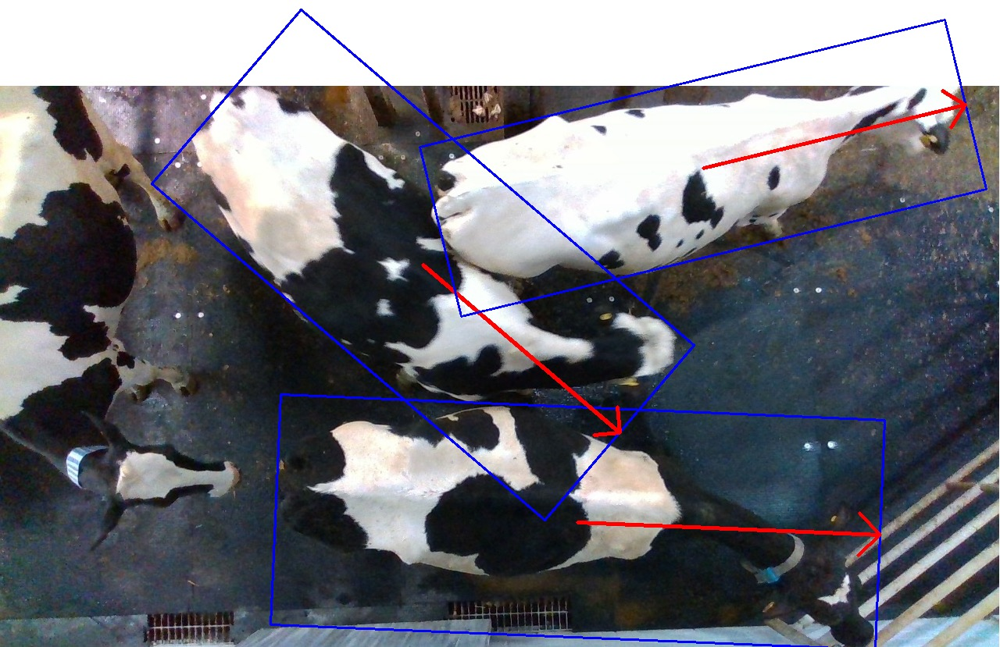

# Cattle-ROBB Dataset
## Motivation
Current oriented object detection datasets use OBBs or polygons to annotate objects. 
The polygons are converted to minimum enclosing OBBs before being fed into detection models. 
The OBB is often represented as $[x_c, y_c, w, h, \theta]$ where $(x_c, y_c)$ is box center, $(w, h)$ is for width and height, 
and $\theta$ refers to how much the rectangle rotates in range $(-\pi/2,0]$. 
The OBB can also be represented as four corner points $[x_1, y_1, x_2, y_2, x_3, y_3, x_4, y_4]$. 
In fact, 
**the orientation $\theta$ is just a parameter for the oriented box definition instead of indicating the intrinsic orientation of the target object**. 

However, the livestock has intrinsic orientations in $[0, 2\pi)$, usually represented by head or body direction in stockbreeding context. 
This intrinsic orientation is a very fundamental indicator in developing intelligent stockbreeding downstream applications, such as body size estimation, and eating activity monitoring. 
Moreover, usually, only a single species is kept on one animal farm. 
Therefore, we re-annotate a single-category top-view cattle object detection dataset with real-oriented bounding boxes (ROBB) annotation. 
The ROBB extends OBB by explicitly annotating the intrinsic orientations of cattle individuals to oriented bounding boxes. 
In other words, the orientation of ROBB represents the intrinsic orientation of cattle body within the range $[0, 2\pi)$. 

## Implementation
We extend the Cows2021 dataset by re-annotating the entire cattle body with ROBB. 
We select 5587 images with at least one entire cattle body from the total of 10402 images in Cows2021. 
The original images are resolved at $1280 \times 720$, 
but for ROBB annotation the corner points of bounding boxes may locate outside the image if the cattle bodies are near the image boundary. 
So first the original images are padded to $1680 \times 1120$ with $(255, 255, 255)$, 
then open-source image-labeling tool [roLabelImg](https://github.com/cgvict/roLabelImg) is utilized for raw annotation and finally, 
raw labels are processed by python scripts. 

## Definition
The ROBB definition in Cattle-ROBB is illustrated in the following image. 

$(x_c, y_c)$ is the center point, 
$w$ and $h$ refer to along-body and cross-body dimension respectively, 
$\theta$ represents orientation in the range $[0, 2\pi)$ and counter-clockwise rotation starting from x-axis makes positive $\theta$. 
The following figures depict one, two, and three ROBBs in a single image respectively. 

## Statistics
### Center point
The distribution of the center point is depicted in the next figure.
Boxes are densely distributed on top-part images because the region under surveillance is a corner on a walkway from top-left to top-right,
hence the walking distance is shorter if cattle individuals pass this region through the top-part image area.

### Orientation $\theta$
The next figure shows the distribution of orientation $\theta$. 
Note that the y-axis is logarithmic and the unit of the x-axis is converted to degree.
Orientations concentrate on a narrow range of $[0, \pm50^{\circ})$ approximately,
which is also due to the left-to-right walking direction under the surveillance camera.
But dataset users can still apply data augmentation techniques like flipping and rotating to balance the orientation distribution.

### $w/h$ ratio
$w/h$ ratio is in a wide range from 1.0 to 4.0 and peaks at about 3.0 as shown in the next figure,
which is consistent with our daily observation.
Close inspections into samples near 1.0 show that cattle individuals turning their heads backward will give a small $w/h$ ratio.
These samples enrich the non-rigid feature of cattle objects and increase detection difficulty.

### Box-number-per-image
The next figure shows that the majority of images contain just one ROBB,
and about 10% images have two ROBBs. 3 and 4-ROBB samples are less.

